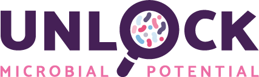

**Large-scale open infrastructure for microbial research**\
UNLOCK large-scale open infrastructure for microbial research gives you access to unique facilities and state-of-the-art equipment that allows you to conduct innovative experiments and tackle novel research questions. UNLOCK is set up and maintained by microbial scientists from TU Delft and Wageningen University & Research, who are also at hand to provide expertise and technical support. The facilities are easily accessible to researchers from all over the world and highly subsidised for academic users. **Visit [www.m-unlock.com](https://www.m-unlock.com) for more information**

---

Our code repositories are on [https://www.gitlab.com/m-unlock](https://www.gitlab.com/m-unlock)

### For example:

**FAIR DATA STATION**\
A tool for FAIR metadata management: [fairds.fairbydesign.nl](https://fairds.fairbydesign.nl)

**code**: [gitlab.com/m-unlock/fairds](https://www.gitlab.com/m-unlock/fairds)

**Common Workflow Language (CWL) computational workflows**\
Find them on [WorkflowHub.eu](https://workflowhub.eu/projects/16#workflows)

**code**: [gitlab.com/m-unlock/cwl](https://www.gitlab.com/m-unlock/cwl)

<!--

**Here are some ideas to get you started:**

🙋‍♀️ A short introduction - what is your organization all about?
🌈 Contribution guidelines - how can the community get involved?
👩‍💻 Useful resources - where can the community find your docs? Is there anything else the community should know?
🍿 Fun facts - what does your team eat for breakfast?
🧙 Remember, you can do mighty things with the power of [Markdown](https://docs.github.com/github/writing-on-github/getting-started-with-writing-and-formatting-on-github/basic-writing-and-formatting-syntax)
-->
